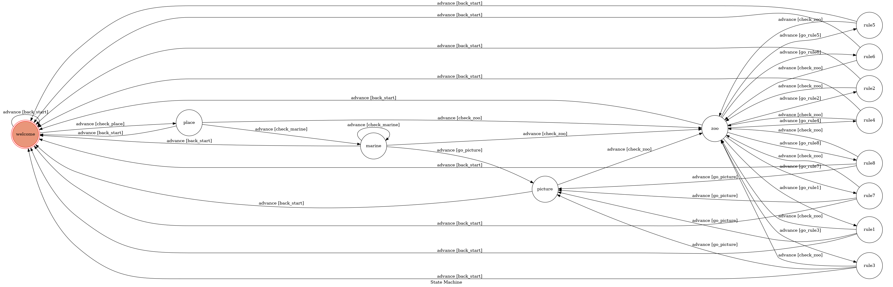
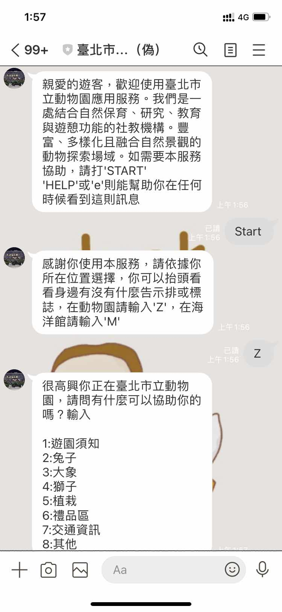
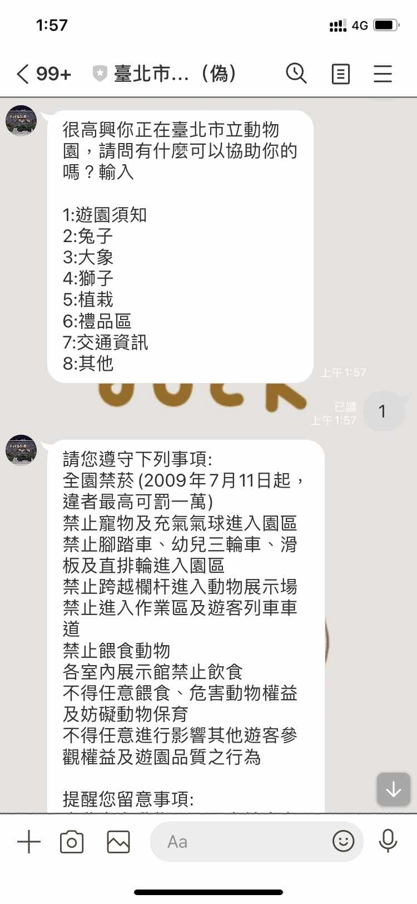
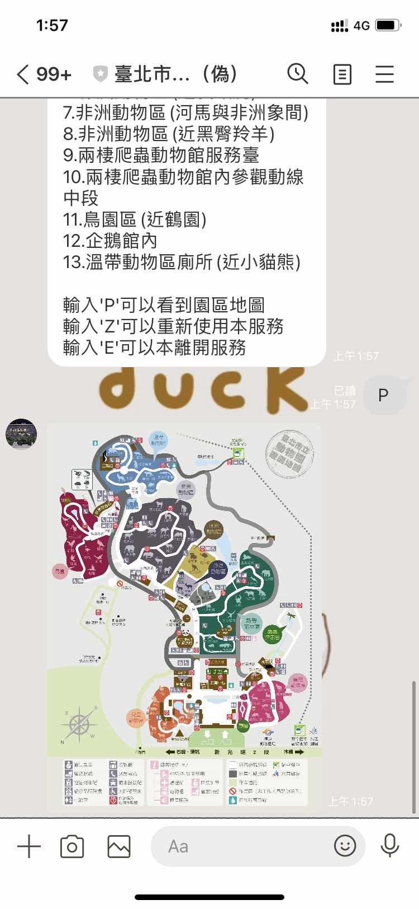

# TOC Project - FakeZoo

[](https://codeclimate.com/github/NCKU-CCS/TOC-Project-2020/maintainability)

[](https://snyk.io/test/github/NCKU-CCS/TOC-Project-2020)


A Line bot based on a finite state machine

More details in the [Slides](https://hackmd.io/@TTW/ToC-2019-Project#) and [FAQ](https://hackmd.io/s/B1Xw7E8kN)

## Setup

### Prerequisite
* Python 3.8
* Pipenv
* Line App
* HTTPS Server
* Redis

#### Install Dependency
```sh
pip3 install pipenv

pipenv --three

pipenv install

pipenv shell
```

* pygraphviz (For visualizing Finite State Machine)
    * [Setup pygraphviz on Ubuntu](http://www.jianshu.com/p/a3da7ecc5303)
	* [Note: macOS Install error](https://github.com/pygraphviz/pygraphviz/issues/100)


#### Secret Data
You should generate a `.env` file to set Environment Variables refer to our `.env.sample`.  
`LINE_CHANNEL_SECRET` and `LINE_CHANNEL_ACCESS_TOKEN` **MUST** be set to proper values.
Otherwise, you might not be able to run your code.  
You should also set your `REDIS_TLS_URL` for the use of REDIS. (A sample method is mentioned behind)

#### Run Locally
You can either setup https server or using `ngrok` as a proxy.

#### Ngrok installation
* [ macOS, Windows, Linux](https://ngrok.com/download)

or you can use Homebrew (MAC)
```sh
brew cask install ngrok
```

**`ngrok` would be used in the following instruction**

```sh
ngrok http 8000
```

After that, `ngrok` would generate a https URL.

#### Run the sever

```sh
python3 app.py
```

## Finite State Machine


The initial state is set to `welcome`.

Every time `welecome` state is triggered to `advance` to another state, it can back to `welcome` state as long as the input is `help` or `e`.

Each input is not case sensitive, it also allow blank after the input string.

I also use Redis in Heroku to record the state for each user.

## Usage

### Bot QRcode


 Once you add as friend, you will see the welcome message:


 And below is an example



## Deploy
Setting to deploy webhooks on Heroku.

### Heroku CLI installation

* [macOS, Windows](https://devcenter.heroku.com/articles/heroku-cli)

or you can use Homebrew (MAC)
```sh
brew tap heroku/brew && brew install heroku
```

or you can use Snap (Ubuntu 16+)
```sh
curl https://cli-assets.heroku.com/install.sh | sh
```

### Connect to Heroku

1. Register Heroku: https://signup.heroku.com

2. Create Heroku project from website

3. CLI Login

	`heroku login`

### Upload project to Heroku

1. Add local project to Heroku project (or you can build it)

	`heroku git:remote -a {HEROKU_APP_NAME}`

2. Set buildpack in Heroku (for `pygraphviz` usage)

	```
	heroku buildpacks:set heroku/python
	heroku buildpacks:add --index 1 heroku-community/apt
	heroku buildpacks:add https://github.com/weibeld/heroku-buildpack-graphviz
	heroku buildpacks
	```

3. Heroku Redis Add-ons (optional)

   If you havn't deploy your redis, you can use Heroku addons.

   You should verified your Heroku account before you execute these command.

	```
	heroku addons:create heroku-redis:hobby-dev -a your-app-name
	```
  
   if you want to run locally, use `heroku config:get REDIS_TLS_URL -s >> .env` to get the URL which will use in this process.

4. Set Environment - Line Messaging API Secret Keys

	```
	heroku config:set LINE_CHANNEL_SECRET=your_line_channel_secret
	heroku config:set LINE_CHANNEL_ACCESS_TOKEN=your_line_channel_access_token
	```

5. Upload project

	```
	git add .
	git commit -m "Add code"
	git push heroku master
	```

6. Your Project is now running on Heroku!

	url: `{HEROKU_APP_NAME}.herokuapp.com/callback`

	debug command: `heroku logs --tail --app {HEROKU_APP_NAME}`

## Reference
[Pipenv](https://medium.com/@chihsuan/pipenv-更簡單-更快速的-python-套件管理工具-135a47e504f4) [@chihsuan](https://github.com/chihsuan)

[TOC-Project-2019](https://github.com/winonecheng/TOC-Project-2019) [@winonecheng](https://github.com/winonecheng)

Flask Architecture  [@Sirius207](https://github.com/Sirius207)

[Line line-bot-sdk-python](https://github.com/line/line-bot-sdk-python/tree/master/examples/flask-echo)

[Heroku and pygraphviz](https://hackmd.io/@ccw/B1Xw7E8kN?type=view#Q2-如何在-Heroku-使用-pygraphviz)

[Heroku Redis Add-pns](https://devcenter.heroku.com/articles/heroku-redis)